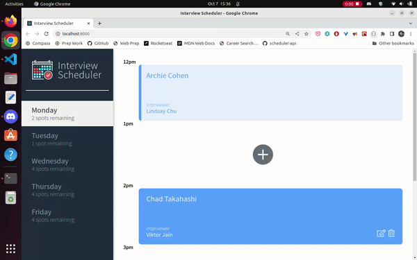
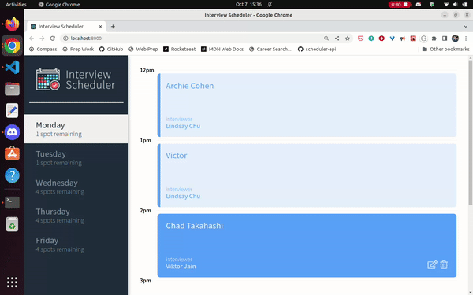

# Interview Scheduler

Interview Scheduler is a single-page application (SPA) that allows users to book technical interviews between students and mentors.

This project was build with React as part of my Lighthouse Labs studies, having the client application communicate with an API server over HTTP, using Axios to make calls to the API, and I coudl also experience with different development environments, including Storybook, Jest, and Webpack Dev Server.

## Final Product

### Adding an interview

### Deleting an interview



## Getting Started

Install dependencies with `npm install`.

## Running Webpack Development Server

```sh
npm start
```

## Running Jest Test Framework

```sh
npm test
```

## Running Storybook Visual Testbed

```sh
npm run storybook
```

## API Server and Database Setup

For full functionality and test purposes you can fork and clone scheduler-api server [here](https://github.com/lighthouse-labs/scheduler-api)

## Dependencies

- Axios
- Classnames
- Normalize CSS
- React
- React-dom
- React-scripts

## Enjoy!


